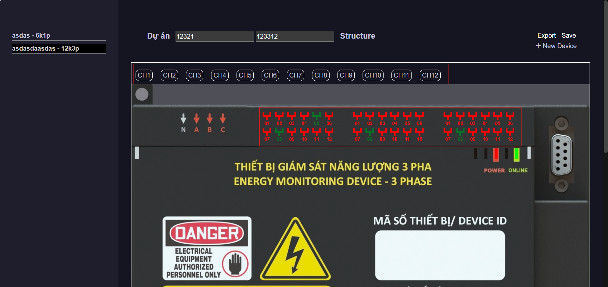
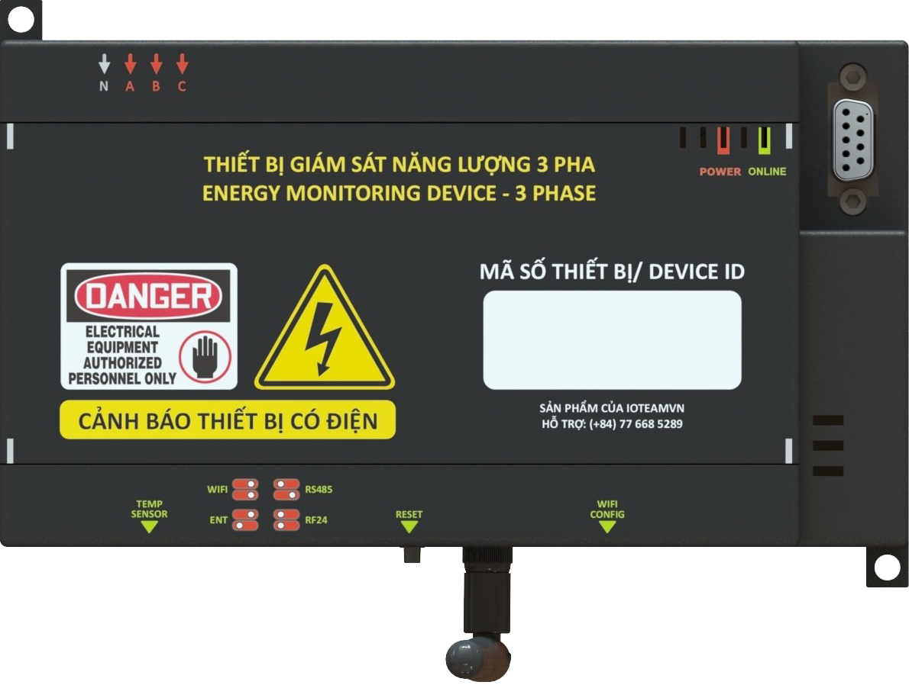

# Mô tả

Trang cập nhật thông tin dự án và thiết bị

# Cấu trúc

**/assset/css**

```
app.css
app-dark.css
iconly.css
style.css
addProject.css
```

**/asset/js**

```
app.js          // default
addProject.js   // các thao tác với thiết bị (CRUD)
channel.js      // các thao tác với kênh (CRUD)
structure.js    // các thao tác với cấu trúc
check.js        // các hàm kiểm tra
export.js       // xuất dữ liệu
```

# Hướng dẫn sử dụng

## 1. Nhập thông tin dự án


## 2. Thêm cấu trúc

Mở giao diện thêm cấu trúc

Lựa chọn thêm cấp độ

Nhập vào thông tin

Cập nhật


## 3.Thêm thiết bị mới

Mở giao diện thêm thiết bị

Nhập thông tin và cập nhật


## 4. Thêm kênh

Chọn kênh

Thêm thông tin và cập nhật


## 5.Lưu và xuất dữ liệu


## 6.Kết nối với CMS
Dữ liệu xuất ra, copy sang project_data.JSON và sử dụng bình thường


# Hướng dẫn bảo trì

## 1. Thao tác với thiết bị (addProject.js)

### 1.1: Dữ liệu

#### 1.1.1: Biến lưu trữ dự án

Gồm thông tin về dự án và các thiết bị bên trong

```bash
var projectData = {
    "projectCode": '',
    "projectName": '',
    "devices": []
}
```

#### 1.1.2: Biến lưu trữ cấu trúc dự án

Lưu trữ các level và dữ liệu liên quan (levelName, levelCode)

```bash
var jsonStructure = {
    "level0": []
}
```

#### 1.1.3: Mảng lưu trữ kênh

Ánh xạ các kênh

```bash
var mapping = {
    "CH1": ["A11", "A21", "A31", "P1", "P2", "P3"],
    "CH2": ["A12", "A22", "A32"],
    "CH3": ["A13", "A23", "A33"],
    "CH4": ["A14", "A24", "A34"],
    "CH5": ["A15", "A25", "A35"],
    "CH6": ["A16", "A26", "A36"],
    "CH7": ["A41", "A51", "A61"],
    "CH8": ["A42", "A52", "A62"],
    "CH9": ["A43", "A53", "A63"],
    "CH10": ["A44", "A54", "A64"],
    "CH11": ["A45", "A55", "A65"],
    "CH12": ["A46", "A56", "A66"]
};
```

Ánh xạ ngược

```bash
var reversedMapping = {};
for (var key in mapping) {
    if (mapping.hasOwnProperty(key)) {
        var values = mapping[key];
        for (var i = 0; i < values.length; i++) {
            var value = values[i];
            if (!reversedMapping.hasOwnProperty(value)) {
                reversedMapping[value] = [];
            }
            reversedMapping[value].push(key);
        }
    }
}
```

### 1.2 Sự kiện

#### 1.2.1: Mở mockup

-Hiển thị mockup đã bị ẩn đi
-Khởi tạo ô chọn cấu trúc
-Khởi tạo nút `Save`

```bash
$('#add-project').on('click', '.add-device-btn', function () {
        $('.add-device-mockup').removeClass('hide');
        createSelectInputsForLevels('.device-lv');
        var addDeviceIndex = '<button type="reset" class="btn btn-primary me-1 mb-1 device-add">Save</button>'
        $('.device-btns').append(addDeviceIndex);
        $('#ma').focus();
    })
```

### 1.2.2: Thêm thiết bị

-Đọc dữ liệu từ form
-Kiểm tra `Mã thiết bị` và `Loại thiết bị`
-Thêm thiết bị vào `projectData`
-Khởi tạo trang thông tin dự án
-Đặt giá trị form về mặc định
-Ẩn mockup

```bash
    $('.add-device-mockup').on('click', '.device-add', function () {
        // đọc dữ liệu
        if ($('#ma').val() === '' || $('#loaitb').val() === '' || $('#loaitb').val() === null) {
            alert('Điền đủ mã thiết bị và loại thiết bị');
            return;
        }

        var device = {
            code: $('#ma').val(),
            cabinet: $('#cabinet').val() || 0,
            date: $('#ngay').val() || 0,
            lv1: $('.level1-inputs').val() || 0,
            lv2: $('.level2-inputs').val() || 0,
            lv3: $('.level3-inputs').val() || 0,
            lv4: $('.level4-inputs').val() || 0,
            lv1code: $('.level1-inputs').find('option:selected').data('code'),
            lv2code: $('.level2-inputs').find('option:selected').data('code'),
            lv3code: $('.level3-inputs').find('option:selected').data('code'),
            lv4code: $('.level4-inputs').find('option:selected').data('code'),
            deviceType: $('#loaitb').val(),
            channels: [],
        };

        // kiểm tra mã thiết bị
        for (var i = 0; i < projectData.devices.length; i++) {
            var check = projectData.devices[i];
            if (device.code == check.code) {
                alert('Mã thiết bị đã tồn tại');
                return;
            }
        }

        // thêm thiết bị vào data
        projectData.devices.push(device);

        var newDevices = '<li class="sidebar-item  ">' +
            '<div class="device-added device-added-' + device.code + '">' +
            '<div class="device-hd" data-info="' + device.code + '" data-type="' + device.deviceType + '">' +
            '<span>' + device.code + ' - ' + device.deviceType + '</span>' +
            '</li>'
        $('.menu').append(newDevices)

        $('.color-gray').removeClass('color-gray');
        $(this).toggleClass('color-gray');
        $('#main').find('.device-added').remove();
        addProject(device);

        switch (device.deviceType) {
            case '1k3p': addChannelList1k3p(device.code);
                break;
            case '6k1p': addChannelList6k1p(device.code);
                break;
            case '6k3p': addChannelList6k3p(device.code);
                break;
            case '12k3p': addChannelList12k3p(device.code);
                break;
        }

        initializeTooltips();

        // đặt lại giá trị về mặc định
        $('#ma').val('');
        $('#cabinet').val('');
        $('#ngay').val('');
        $('#loaitb').val('');

        // ẩn mockup
        $('.device-lv').find('.mockup').remove();
        $('.device-add').remove();
        $('.add-device-mockup').addClass('hide');
    })
```

### 1.2.3: Chỉnh sửa thiết bị

-Thêm trạng thái `editing` cho thiết bị
-Hiển thị mockup
-Khởi tạo ô chọn cấu trúc
-Tìm và truyền thông tin thiết bị từ `projectData` và truyền vào form
-Khởi tạo nút `Save`

```bash
$('.add-device').on('click', '.edit-device-btn', function () {
        $(this).parent().addClass('editing')
        $('.add-device-mockup').removeClass('hide');
        $('.add-device-mockup').find('.loaitb').prop('disabled', true);

        var deviceCode = $(this).data('info');
        createSelectInputsForLevels('.device-lv');
        for (var i = 0; i < projectData.devices.length; i++) {
            var device = projectData.devices[i];
            if (device.code == deviceCode) {
                $('#ma').val(device.code);
                $('#cabinet').val(device.cabinet);
                $('#ngay').val(device.date);
                $('.level1-inputs').val(device.lv1);
                populateSelectOptionsForLevel(device.lv1, 2);
                $('.level2-inputs').val(device.lv2);
                populateSelectOptionsForLevel(device.lv2, 3);
                $('.level3-inputs').val(device.lv3);
                populateSelectOptionsForLevel(device.lv3, 4);
                $('.level4-inputs').val(device.lv4);
                $('#loaitb').val(device.deviceType);
            }
        }

        var editDeviceIndex = '<button type="reset" class="btn btn-primary me-1 mb-1 edit-device-save" data-info="' + deviceCode + '">Save</button>';
        $('.device-btns').append(editDeviceIndex)
    })
```

### 1.2.4: Lưu bản chỉnh sửa thiết bị

-Tìm thiết bị đang chỉnh sửa
-Lưu dữ liệu đọc từ form
-Xóa trạng thái `editing`
-Ẩn mockup

```bash
$('.add-device-mockup').on('click', '.edit-device-save', function () {
        var deviceCode = $('.editing').data('info');
        $('.add-device-mockup').find('.loaitb').prop('disabled', false);
        for (var i = 0; i < projectData.devices.length; i++) {
            var device = projectData.devices[i];
            if (device.code == deviceCode) {
                device.code = $('#ma').val();
                device.cabinet = $('#cabinet').val();
                device.date = $('#ngay').val();
                device.lv1 = $('.level1-inputs').val();
                device.lv2 = $('.level2-inputs').val();
                device.lv3 = $('.level3-inputs').val();
                device.lv4 = $('.level4-inputs').val();
                device.lv1code = $('.level1-inputs').find('option:selected').data('code');
                device.lv2code = $('.level2-inputs').find('option:selected').data('code');
                device.lv3code = $('.level3-inputs').find('option:selected').data('code');
                device.lv4code = $('.level4-inputs').find('option:selected').data('code');
                break; // Kết thúc vòng lặp khi tìm thấy thiết bị cần chỉnh sửa
            }
        }
        $('.editing').removeClass('editing');
        $('.edit-device-save').remove();
        $('.add-device-mockup').addClass('hide');
        $('.device-lv').find('.mockup').remove();
    });
```

### 1.2.5: Xóa thiết bị

-Xác nhận xóa
-Xóa thiết bị trong `projectData`
-Xóa trang thông tin thiết bị

```bash
$('.add-device').on('click', '.delete-device-btn', function () {
        var deviceID = $(this).data('info')
        var check = confirm('Are you sure you want to delete?');
        if (check) {
            $(this).parent().parent().remove();
        }
        else {
            return;
        }
        for (var i = 0; i < projectData.devices.length; i++) {
            var device = projectData.devices[i];
            if (device.code == deviceID) {
                projectData.devices.splice(i, 1);
                break;
            }
        }
        $('.menu').find('.device-added-' + deviceID).remove();
    })
```

### 1.2.6: Chọn thiết bị

-Đánh dấu thiết bị trên danh sách
-Khởi tạo trang thông tin thiết bị
-Khởi tạo danh sách kênh

```bash
    $('.menu').on('click', '.device-hd', function () {
        $('.color-gray').removeClass('color-gray');
        $(this).toggleClass('color-gray');
        var deviceID = $(this).data('info');
        var deviceType = $(this).data('type')
        $('#main').find('.device-added').remove();
        for (var i = 0; i < projectData.devices.length; i++) {
            var device = projectData.devices[i];
            if (device.code == deviceID) {
                addProject(device);
            }
        }
        switch (deviceType) {
            case '1k3p': addChannelList1k3p(deviceID);
                break;
            case '6k1p': addChannelList6k1p(deviceID);
                break;
            case '6k3p': addChannelList6k3p(deviceID);
                break;
            case '12k3p': addChannelList12k3p(deviceID);
                break;
        }
        // khởi tạo danh sách thiết bị
        if (device.channels && device.channels.length > 0) {
            $('.device-added-' + device.code).find('table').remove();
            $('#main').find('.device-added-' + device.code).append(createchannelTable(device.code));
        }

        for (var i = 0; i < projectData.devices.length; i++) {
            if (projectData.devices[i].code == deviceID) {
                var foundDevice = projectData.devices[i];
                for (var j = 0; j < foundDevice.channels.length; j++) {
                    console.log(0)
                    if (mapping.hasOwnProperty(foundDevice.channels[j].chonch)) {
                        console.log(1)
                        var Values = mapping[foundDevice.channels[j].chonch];
                        for (var k = 0; k < Values.length; k++) {
                            $('#main').find('.device-added-' + deviceID).find('.channel-' + Values[k]).addClass('created');
                        }
                    }
                    $('#main').find('.device-added-' + deviceID).find('.channel-' + foundDevice.channels[j].chonch).addClass('created');
                }
            }
        }

        initializeTooltips();
    })
```

### 1.2.7: Đóng mockup

-Xóa các nút đã được khởi tạo
-Xóa ô chọn cấu trúc
-Ẩn mockup

```bash
$('.add-device-mockup').on('click', '.device-close', function (event) {
        event.preventDefault()
        $('.edit-device-save').remove();
        $('.device-add').remove();
        $('.add-device-mockup').find('.loaitb').prop('disabled', false);
        $('.add-device-mockup').addClass('hide');
        $('.device-lv').find('.mockup').remove();
    })
```

### 1.2.8: Các hàm sử dụng

#### 1.2.8.1: addProject (device)

-Khởi tạo trang thông tin thiết bị

```bash
function addProject(device) {
        var newDevice = '<div class="device-added device-added-' + device.code + '" data-info="' + device.code + '">' +
            '<div style="border:1px #fff solid; padding-top:20px">' +
            '<div class="channel-diagram"></div>' +
            '<div class="channel-list" data-info="' + device.code + '"></div>' +
            '</div>' +
            '<div class="device-hd" data-info="' + device.code + '">' +
            '<span>' + device.code + ' - ' + device.cabinet + ' - ' + device.date + ' - ' + device.deviceType + '</span>' +
            '<span class="edit-device-btn" data-info="' + device.code + '"><i class="fa-solid fa-pen-to-square"></i> Edit Device</span>' +
            '<span class="delete-device-btn" data-info="' + device.code + '"><i class="fa-solid fa-trash"></i> Delete Device</span>';
        // '<span class="add-channel-btn" style="margin-right:10px" data-info="' + device.code + '" data-type="' + device.deviceType + '"><i class="fa-solid fa-plus"></i> Add channel</span>' +
        // '<i class="fa-solid fa-caret-down" data-info="' + device.code + '"></i>';

        // Thêm đối tượng mới vào DOM
        $('.add-device-main').append(newDevice);
        if (device.channels && device.channels.length > 0) {
            $('.device-added-' + device.code).find('table').remove();
            $('#main').find('.device-added-' + device.code).append(createchannelTable(device.code));
        }
    }
```

#### 1.2.8.2: Hàm tạo danh sách kênh (addChannelList)

1k3p

```bash
function addChannelList1k3p(deviceID) {
        var list = ['CH1'];
        for (var i = 0; i < list.length; i++) {
            var chonch = list[i];
            var channelID = i + 1;
            $('.channel-diagram').append(createChannelLink(channelID, chonch, deviceID));
        }
        var channelList = ['CT A', 'CT B', 'CT C']
        var PhaseA = $('<div></div>').addClass('Phase');
        for (var i = 1; i <= 3; i++) {
            var chonch = 'P' + i;
            var button = createSVGButton(deviceID, chonch, channelList[i - 1]);
            PhaseA.append(button);
        }
        $('.channel-list').append(PhaseA);
        var img = ''
        $('.channel-list').parent().append(img)
    }
```

6k1p

```bash
function addChannelList6k1p(deviceID) {
        var channelList = ['C6', 'C5', 'C4', 'C3', 'C2', 'C1']
        var PhaseA = $('<div></div>').addClass('Phase');
        for (var i = 6; i >= 1; i--) {
            var chonch = 'A1' + i;
            var button = createSVGButton(deviceID, chonch, channelList[i - 1]);
            PhaseA.append(button);
        }
        $('.channel-list').append(PhaseA);
        var img = ''
        $('.channel-list').parent().append(img)
    }
```

6k3p

```bash
function addChannelList6k3p(deviceID) {
        var list = ['CH1', 'CH2', 'CH3', 'CH4', 'CH5', 'CH6'];
        for (var i = 0; i < list.length; i++) {
            var chonch = list[i];
            var channelID = i + 1; // Sử dụng chỉ số i + 1 để tạo ID cho mỗi kênh
            $('.channel-diagram').append(createChannelLink(channelID, chonch, deviceID));
        }
        var channelList = ['01', '02', '03', '04', '05', '06']
        var PhaseA = $('<div></div>').addClass('PhaseA');
        for (var i = 1; i <= 6; i++) {
            var chonch = 'A1' + i;
            var button = createSVGButton(deviceID, chonch, channelList[i - 1]);
            PhaseA.append(button);
        }
        $('.channel-list').append(PhaseA);
        var PhaseB = $('<div></div>').addClass('PhaseB');
        for (var i = 1; i <= 6; i++) {
            var chonch = 'A2' + i;
            var button = createSVGButton(deviceID, chonch, channelList[i - 1]);
            PhaseB.append(button);
        }
        $('.channel-list').append(PhaseB);
        var PhaseC = $('<div></div>').addClass('PhaseC');
        for (var i = 1; i <= 6; i++) {
            var chonch = 'A3' + i;
            var button = createSVGButton(deviceID, chonch, channelList[i - 1]);
            PhaseC.append(button);
        }
        $('.channel-list').append(PhaseC);
        var img = ''
        $('.channel-list').parent().append(img)
    }
```

12k3p

```bash
function addChannelList12k3p(deviceID) {
        var list = ['CH1', 'CH2', 'CH3', 'CH4', 'CH5', 'CH6', 'CH7', 'CH8', 'CH9', 'CH10', 'CH11', 'CH12'];
        for (var i = 0; i < list.length; i++) {
            var chonch = list[i];
            var channelID = i + 1; // Sử dụng chỉ số i + 1 để tạo ID cho mỗi kênh
            $('.channel-diagram').append(createChannelLink(channelID, chonch, deviceID));
        }

        var channelList = ['01', '02', '03', '04', '05', '06', '07', '08', '09', '10', '11', '12']
        var PhaseA = $('<div></div>').addClass('PhaseA');
        for (var i = 1; i <= 6; i++) {
            var chonch = 'A1' + i;
            var button = createSVGButton(deviceID, chonch, channelList[i - 1]);
            PhaseA.append(button);
        }
        for (var i = 1; i <= 6; i++) {
            var chonch = 'A4' + i;
            var button = createSVGButtonBot(deviceID, chonch, channelList[i + 5]);
            PhaseA.append(button);
        }
        $('.channel-list').append(PhaseA);
        var PhaseB = $('<div></div>').addClass('PhaseB');
        for (var i = 1; i <= 6; i++) {
            var chonch = 'A2' + i;
            var button = createSVGButton(deviceID, chonch, channelList[i - 1]);
            PhaseB.append(button);
        }
        for (var i = 1; i <= 6; i++) {
            var chonch = 'A5' + i;
            var button = createSVGButtonBot(deviceID, chonch, channelList[i + 5]);
            PhaseB.append(button);
        }
        $('.channel-list').append(PhaseB);
        var PhaseC = $('<div></div>').addClass('PhaseC');
        for (var i = 1; i <= 6; i++) {
            var chonch = 'A3' + i;
            var button = createSVGButton(deviceID, chonch, channelList[i - 1]);
            PhaseC.append(button);
        } for (var i = 1; i <= 6; i++) {
            var chonch = 'A6' + i;
            var button = createSVGButtonBot(deviceID, chonch, channelList[i + 5]);
            PhaseC.append(button);
        }
        $('.channel-list').append(PhaseC);
        var img = ''
        $('.channel-list').parent().append(img)
    }
```

```bash
function createChannelLink(i, chonch, deviceID) {
        var html = '<div class="channel-link-' + i + ' channel-link" data-info="' + chonch + '">' +
            '<span class="' + chonch + '-channel channel1phase" data-chonch="' + chonch + '" data-chonpha="3 pha" data-deviceid="' + deviceID + '">' + chonch + '</span> </div>'
        return html;
    }
```

#### 1.2.8.3: Hàm tạo nút chọn kênh (createSVGButton)

```Bash
function createSVGButton(deviceID, chonch, text) {
        var div = $('<div></div>')
            .addClass('channel')
            .addClass('channel-' + chonch)
            .data('chonch', chonch)
            .data('chonpha', '1 pha')
            .data('deviceid', deviceID)
            .attr('data-bs-toggle', 'tooltip')
            .attr('data-bs-placement', 'top')
            .prop('title', chonch);

        var svg = ''
        div.append(svg);
        var span = $('<span></span>').text(text);
        div.append(span);
        return div;
    }
```

```bash
function createSVGButtonBot(deviceID, chonch, text) {
        var div = $('<div></div>')
            .addClass('channel')
            .addClass('channel-' + chonch)
            .data('chonch', chonch)
            .data('chonpha', '1 pha')
            .data('deviceid', deviceID)
            .attr('data-bs-toggle', 'tooltip')
            .attr('data-bs-placement', 'bottom')
            .prop('title', chonch);

        var svg = ''
        div.append(svg);
        var span = $('<span></span>').text(text);
        div.append(span);
        return div;
    }
```

### 1.2.9: Hiệu ứng

#### 1.2.9.1: Xóa hiệu ứng mặc định của form `Bootstrap`

```bash
$('input').on('keypress keydown', function (event) {
        if (event.which === 13) {
            event.preventDefault();
        }
    });
```

#### 1.2.9.2: Kích hoạt tooltip

```bash
function initializeTooltips() {
        $('#main').children().each(function () {
            $(this).find('.channel').each(function () {
                $(this).tooltip({
                    placement: $(this).data('bs-placement'),
                    title: $(this).attr('title'),
                });
            });
        });
    }
```

#### 1.2.9.3: Hover danh sách kênh

```bash
var hoverTimer;
    $('#main').on('mouseenter', '.channel1phase', function () {
        hoverTimer = setTimeout(function () {
            var Values = mapping[link];
            for (var i = 0; i < Values.length; i++) {
                $('#main').find('.channel-' + Values[i]).addClass('related-link')
            }
        }, 200);

        var link = $(this).data('chonch');
    });

    $('#main').on('mouseleave', '.channel1phase', function () {
        clearTimeout(hoverTimer);
        var link = $(this).data('chonch');
        hoverTimer = setTimeout(function () {
            var Values = mapping[link];
            for (var i = 0; i < Values.length; i++) {
                $('#main').find('.channel-' + Values[i]).removeClass('related-link')
            }
        }, 200);
    });
```

## 2. Thao tác với kênh (channel.js)

### 2.1: Mở mockup

-Tìm thiết bị trong projectData
-Kiểm tra kênh tồn tại
-Thêm kênh

```bash
$('#main').on('click', '.channel', function () {
    var deviceID = $(this).data('deviceid')
    console.log(deviceID)
    var chonch = $(this).data('chonch')
    var chonpha = $(this).data('chonpha')
    if (!checkChannel(chonch, deviceID)) {
        alert('kênh đã tồn tại!')
        return;
    }
    addChannel(deviceID, chonch, chonpha);
});
```

```bash
$('#main').on('click', '.channel1phase', function () {
    var deviceID = $(this).data('deviceid')
    console.log(deviceID)
    var chonch = $(this).data('chonch')
    var chonpha = $(this).data('chonpha')
    if (!checkChannel(chonch, deviceID)) {
        alert('kênh đã tồn tại!')
        return;
    }
    addChannel(deviceID, chonch, chonpha);
})
```

### 2.2: Thêm kênh

-Đọc dữ liệu, lưu vào thiết bị
-Đặt form về mặc định
-Thêm kênh vào bảng kênh
-Ẩn mockup

```bash
// lưu
$('.add-channel-mockup').on('click', '.channel-save', function () {
    var deviceID = $(this).data('info');

    var channel = {
        chonpha: $('.add-channel-mockup').find('.card-title').data('chonpha'),
        chonch: $('.add-channel-mockup').find('.card-title').data('info'),
        itt: $('input[name="itt"]').val() || 0,
        ptt: $('input[name="ptt"]').val() || 0,
        ct: $('input[name="ct"]').val() || 0,
        type: $('input[name="type"]').val() || 0,
        name: $('input[name="name"]').val() || 0,
        sourceFr: $('input[name="sourceFr"]').val() || 0,
        lv1: $('.level1-inputs').val() || 0,
        lv2: $('.level2-inputs').val() || 0,
        lv3: $('.level3-inputs').val() || 0,
        lv4: $('.level4-inputs').val() || 0,
        includeS: $('#includeS').is(':checked'),
        includeL: $('#includeL').is(':checked'),
        source: $('#source').is(':checked'),
        lv1code: $('.level1-inputs').find('option:selected').data('code'),
        lv2code: $('.level2-inputs').find('option:selected').data('code'),
        lv3code: $('.level3-inputs').find('option:selected').data('code'),
        lv4code: $('.level4-inputs').find('option:selected').data('code'),
    };

    for (var i = 0; i < projectData.devices.length; i++) {
        var device = projectData.devices[i];
        if (device.code == deviceID) {
            projectData.devices[i].channels.push(channel);
            break; // Thoát khỏi vòng lặp sau khi thêm kênh
        };
    };
    // đặt form về mặc định
    $('input[name="itt"]').val('');
    $('input[name="ptt"]').val('');
    $('input[name="ct"]').val('');
    $('input[name="type"]').val('');
    $('input[name="name"]').val('');
    $('input[name="source"]').val('');
    $('.level1-inputs').val('');
    $('.level2-inputs').val('');
    $('.level3-inputs').val('');
    $('.level4-inputs').val('');
    $('#includeS').prop('checked', false);
    $('#includeL').prop('checked', false);
    $('#sourceFr').prop('checked', false);

    // thêm vào bảng
    $('.device-added-' + deviceID).find('table').remove();
    $('#main').find('.device-added-' + deviceID).append(createchannelTable(deviceID));
    if (mapping.hasOwnProperty(channel.chonch)) {
        var Values = mapping[channel.chonch];
        for (var i = 0; i < Values.length; i++) {
            $('#main').find('.channel-' + Values[i]).addClass('created');
        }
    }
    $('#main').find('.channel-' + channel.chonch).addClass('created')

    // ẩn mockup
    $('.add-channel-mockup').find('#chonpha').remove();
    $('.add-channel-mockup').find('#chonch').remove();
    $('.channel-lv').find('.mockup').remove();
    $('.channel-save').remove();
    $('.add-channel-mockup').addClass('hide');
});
```

### 2.3: Sửa kênh

-Mở mockup
-Tìm và thêm thông tin kênh vào form
-Khởi tạo nút `Save`

```bash
$('.add-device').on('click', '.edit-channel-btn', function () {
    $('.add-channel-mockup').removeClass('hide');
    var deviceID = $(this).data('deviceid');
    var channelID = $(this).data('info');
    createSelectInputsForLevels('.channel-lv');
    $('.add-channel-mockup').find('.card-title').text('Channel ' + channelID);

    for (var i = 0; i < projectData.devices.length; i++) {
        var device = projectData.devices[i];
        for (var j = 0; j < device.channels.length; j++) {
            var channel = device.channels[j];
            if (channel.chonch == channelID) {
                $('input[name="itt"]').val(channel.itt)
                $('input[name="ptt"]').val(channel.ptt)
                $('input[name="ct"]').val(channel.ct)
                $('input[name="type"]').val(channel.type)
                $('input[name="name"]').val(channel.name)
                $('input[name="sourceFr"]').val(channel.sourceFr)
                $('.level1-inputs').val(channel.lv1);
                populateSelectOptionsForLevel(channel.lv1, 2);
                $('.level2-inputs').val(channel.lv2);
                populateSelectOptionsForLevel(channel.lv2, 3);
                $('.level3-inputs').val(channel.lv3);
                populateSelectOptionsForLevel(channel.lv3, 4);
                $('.level4-inputs').val(channel.lv4);
                $('#loaitb').val(device.deviceType);
                $('#includeS').prop('checked', channel.includeS)
                $('#includeL').prop('checked', channel.includeL)
                $('#source').prop('checked', channel.source)
            }
        }
    }

    var channelSavebtn = '<button type="" class="btn btn-primary me-1 mb-1 edit-channel-save" data-info="' + deviceID + '" data-chonch="' + channelID + '">Save</button>'
    $('.channel-btns').append(channelSavebtn);
});
```

### 2.4: Lưu bản chỉnh sửa kênh

-Tìm và sửa thông tin kênh trong projectData
-Sửa thông tin trong bảng kênh
-Ẩn mockup

```bash
$('.add-channel-mockup').on('click', '.edit-channel-save', function () {
    var deviceID = $(this).data('info');
    var channelID = $(this).data('chonch');
    for (var i = 0; i < projectData.devices.length; i++) {
        var device = projectData.devices[i];
        for (var j = 0; j < device.channels.length; j++) {
            var channel = device.channels[j];
            if (channel.chonch === channelID) {
                channel.itt = $('input[name="itt"]').val();
                channel.ptt = $('input[name="ptt"]').val();
                channel.ct = $('input[name="ct"]').val();
                channel.type = $('input[name="type"]').val();
                channel.name = $('input[name="name"]').val();
                channel.sourceFr = $('input[name="sourceFr"]').val();
                channel.lv1 = $('.level1-inputs').val() || 0;
                channel.lv2 = $('.level2-inputs').val() || 0;
                channel.lv3 = $('.level3-inputs').val() || 0;
                channel.lv4 = $('.level4-inputs').val() || 0;
                channel.includeS = $('#includeS').is(':checked');
                channel.includeL = $('#includeL').is(':checked');
                channel.source = $('#source').is(':checked');
                channel.lv1code = $('.level1-inputs').find('option:selected').data('code');
                channel.lv2code = $('.level2-inputs').find('option:selected').data('code');
                channel.lv3code = $('.level3-inputs').find('option:selected').data('code');
                channel.lv4code = $('.level4-inputs').find('option:selected').data('code');
            }
        }
    }

    // sửa bảng
    $('.device-added-' + deviceID).find('table').remove();
    $('#main').find('.device-added-' + deviceID).append(createchannelTable(deviceID));

    // ẩn mockup
    $('.add-channel-mockup').find('#chonpha').remove();
    $('.add-channel-mockup').find('#chonch').remove();
    $('.channel-lv').find('.mockup').remove();
    $('.edit-channel-save').remove();
    $('.add-channel-mockup').addClass('hide');
});
```

### 2.5: Xóa kênh

-Xác nhận xóa kênh
-Tìm và xóa thông tin kênh trong projectData
-Xóa thông tin kênh trong bảng

```bash
$('.add-device-main').on('click', '.delete-channel-btn', function () {
    var channelID = $(this).data('info');
    var deviceID = $(this).data('deviceid');
    if (confirm('Bạn có chắc chắn muốn xóa kênh này không?')) {
        for (var i = 0; i < projectData.devices.length; i++) {
            var device = projectData.devices[i];
            if (device.code == deviceID) {
                for (var j = 0; j < device.channels.length; j++) {
                    if (device.channels[j].chonch == channelID) {
                        device.channels.splice(j, 1);
                        break;
                    }
                }
                break;
            }
        }
    }
    var $table = $('.device-added-' + deviceID).find('table');
    $table.remove();
    $('#main').find('.device-added-' + deviceID).append(createchannelTable(deviceID));
    var newTable = $('.device-added-' + deviceID).find('table');

    if (mapping.hasOwnProperty(channelID)) {
        var Values = mapping[channelID];
        for (var i = 0; i < Values.length; i++) {
            $('#main').find('.channel-' + Values[i]).removeClass('created');
        }
    }
    $('#main').find('.channel-' + channelID).removeClass('created')

    // Kiểm tra xem bảng mới có hàng nào không
    if (newTable.find('tbody tr').length == 0) {
        newTable.remove(); // Nếu không có hàng nào, loại bỏ bảng mới
    }
});
```

### 2.6: Đóng mockup

-Xóa các nút đã khởi tạo
-Ẩn mockup

```bash
$('.add-channel-mockup').on('click', '.channel-close', function (event) {
    // $('.channel-save').attr('data-info', "");
    event.preventDefault()
    $('.add-channel-mockup').find('#chonpha').remove();
    $('.add-channel-mockup').find('#chonch').remove();
    $('.channel-lv').find('.mockup').remove();
    $('.edit-channel-save').remove();
    $('.channel-save').remove();
    $('.add-channel-mockup').addClass('hide');
});
```

### 2.7: Các hàm sử dụng

#### 2.7.1: Hàm thêm kênh (addChannel)

-Khởi tạo ô chọn cấu trúc
-Khởi tạo nút `Save`
-Thêm vào mockup

```bash
function addChannel(deviceID, chonch, chonpha) {
    $('.channel-lv').find('.mockup').remove();
    $('.add-channel-mockup').find('#chonch').remove();
    createSelectInputsForLevels('.channel-lv');
    $('.add-channel-mockup').removeClass('hide');
    $('.add-channel-mockup').find('.card-title').text('Channel ' + chonch).data('info', chonch).data('chonpha', chonpha);
    var channelSavebtn = '<button type="reset" class="btn btn-primary me-1 mb-1 channel-save" data-info="' + deviceID + '">Save</button>';
    $('.channel-btns').append(channelSavebtn);
}
```

#### 2.7.2: Hàm tạo bảng kênh (createchannelTable)

```bash
function createchannelTable(deviceID) {
    var newDevice = '';
    for (var i = 0; i < projectData.devices.length; i++) {
        if (projectData.devices[i].code == deviceID) {
            var foundDevice = projectData.devices[i];
            newDevice +=
                '<div>' +
                '<table class="table table-lg ' + foundDevice.code + '" >' +
                '<thead>' +
                '<tr>' +
                '<th>LoadID</th>' +
                '<th>Tên</th>' +
                '<th>Kênh</th>' +
                '<th>Lv1</th>' +
                '<th>Lv2</th>' +
                '<th>Lv3</th>' +
                '<th>Lv4</th>' +
                '<th></th>' +
                '<th></th>' +
                '</tr>' +
                '</thead>' +
                '<tbody>';

            // Thêm dữ liệu của các kênh vào bảng
            foundDevice.channels.forEach(function (channel, index) {
                newDevice += '<tr>' +
                    '<td class="text-bold-500">' + index + '</td>' +
                    '<td>' + channel.name + '</td>' +
                    '<td>' + channel.chonch.toUpperCase() + '</td>' +
                    '<td>' + channel.lv1 + '</td>' +
                    '<td>' + channel.lv2 + '</td>' +
                    '<td>' + channel.lv3 + '</td>' +
                    '<td>' + channel.lv4 + '</td>' +
                    '<td class="edit-channel-btn" data-info="' + channel.chonch + '" data-deviceID="' + foundDevice.code + '" data-type="' + foundDevice.deviceType + '">sửa</td>' +
                    '<td class="delete-channel-btn" data-info="' + channel.chonch + '" data-deviceID="' + foundDevice.code + '">xóa</td>' +
                    '</tr>';

                // Cập nhật trạng thái của các kênh
            })
            newDevice += '</tbody>' +
                '</table>' +
                '</div>';
        }
    }
    return newDevice;
}
```

#### 2.7.3: Hàm tạo ô chọn cấu trúc

```bash
function createSelectInputsForLevels(blockName) {
    var container = $(blockName);
    var level0Data = jsonStructure.level0;

    var selectBlock = $('<div class = "mockup">');

    // Tạo ô lựa chọn cho cấp độ 1
    var level1Select = createSelectInputs(1, level0Data);
    selectBlock.append('<label class="level-select" for="lv1">lv1</label>')
    selectBlock.append(level1Select);
    selectBlock.append('</br>')

    // Tạo ô lựa chọn cho cấp độ 2
    var level2Select = createSelectInputs(2, []);
    selectBlock.append('<label class="level-select" for="lv2">lv2</label>')
    selectBlock.append(level2Select);
    selectBlock.append('</br>')


    // Tạo ô lựa chọn cho cấp độ 3
    var level3Select = createSelectInputs(3, []);
    selectBlock.append('<label class="level-select" for="lv3">lv3</label>')
    selectBlock.append(level3Select);
    selectBlock.append('</br>')

    // Tạo ô lựa chọn cho cấp độ 4
    var level4Select = createSelectInputs(4, []);
    selectBlock.append('<label class="level-select" for="lv4">lv4</label>')
    selectBlock.append(level4Select);
    selectBlock.append('</br>')

    container.append(selectBlock);
}
```

```bash
function createSelectInputs(level, data) {
    var selectInputs = $('<select class="select-lv">');
    selectInputs.addClass('level' + level + '-inputs');
    selectInputs.prepend('<option value="0" data-code="0">0</option>');

    // Thêm các lựa chọn cho cấp độ hiện tại
    if (data && data.length > 0) {
        data.forEach(function (item) {
            var option = $('<option>');
            option.text(item.name);
            option.val(item.name);
            option.data('code', item.code);
            selectInputs.append(option);
        });
    }
    return selectInputs;
}
```

#### 2.7.4: Hàm cập nhật ô lựa chọn (populateSelectOptionsForLevel)

```bash
function populateSelectOptionsForLevel(selectedValue, level) {
    var dataForLevel = getDataForLevel(selectedValue, level);
    var selectInputs = $('.level' + level + '-inputs');

    // Xóa các lựa chọn hiện có
    selectInputs.empty();
    selectInputs.append('<option value="0" data-code="0">0</option>'); // Thêm một lựa chọn rỗng

    // Thêm các lựa chọn cho cấp độ hiện tại dựa trên giá trị đã chọn ở cấp độ trước
    if (dataForLevel && dataForLevel.length > 0) {
        dataForLevel.forEach(function (item) {
            var option = $('<option>');
            option.text(item.name);
            option.val(item.name);
            option.data('code', item.code);
            selectInputs.append(option);
        });
    }
}
```

#### 2.7.5: Hàm lấy dữ liệu cho ô lựa chọn (getDataForLevel)

```bash
function getDataForLevel(selectedValue, level) {
    var dataForLevel = [];
    switch (level) {
        case 2:
            var level1Data = jsonStructure.level0;
            level1Data.forEach(function (item) {
                if (item.name === selectedValue && item.children) {
                    dataForLevel = item.children;
                }
            });
            break;
        case 3:
            var level2Data = jsonStructure.level0.flatMap(level1 => level1.children);
            level2Data.forEach(function (item) {
                if (item.name === selectedValue && item.children) {
                    dataForLevel = item.children;
                }
            });
            break;
        case 4:
            var level3Data = jsonStructure.level0.flatMap(level1 => level1.children).flatMap(level2 => level2.children);
            level3Data.forEach(function (item) {
                if (item.name === selectedValue && item.children) {
                    dataForLevel = item.children;
                }
            });
            break;
        default:
            break;
    }
    return dataForLevel;
}
```

### 2.8: Sự kiện thay đổi lựa chọn

```bash
$('.mockup').on('change', '.select-lv', function () {
    var selectedValue = $(this).val();
    var level = parseInt($(this).attr('class').match(/level(\d+)-inputs/)[1]);
    for (var i = level + 1; i <= 4; i++) {
        var selectInput = $('.level' + i + '-inputs');
        selectInput.empty();
        selectInput.append('<option value="0" data-code="0">0</option>');
    }
    // Cập nhật các ô lựa chọn cho các cấp độ tiếp theo dựa trên giá trị đã chọn
    populateSelectOptionsForLevel(selectedValue, level + 1);
});
```

## 3: Thao tác với cấu trúc (struture.js)

### 3.1: Mở mockup

```bash
$('#add-project').on('click', '.structure', function () {
        $('.structure-mockup').removeClass('hide');
    })
```

### 3.2: Đóng mockup

```bash
$('.structure-mockup').on('click', '.struc-close', function () {
        $('.structure-mockup').addClass('hide');
    })
```

### 3.3: Lưu structure

```bash
    $('.structure-mockup').on('click', '.struc-save', function () {
        $('.structure-mockup').addClass('hide');
        SaveStructure();
    })
```

### 3.4: Thêm các cấp độ

```bash
var isAdding = false; // Biến để kiểm tra trạng thái đang thêm mới hay không
    $('.container').on('click', '.add-button', function () {
        var parentBlock = $(this).parent(); // Lưu trữ khối cha
        if ($('.container').find('.add-input').length) {
            $('.container').find('.add-input').remove(); // Xóa input hiện có nếu đang tồn tại trong khối cha
            $('.container').find('.add-code').remove(); // Xóa input hiện có nếu đang tồn tại trong khối cha
            $('.container').find('.ok-button').remove();
            $('.container').find('.cancel-button').remove(); // Xóa nút hủy trong khối cha
        }
        isAdding = true; // Thiết lập trạng thái đang thêm mới
        var level = parseInt(parentBlock.attr('class').match(/block-level-(\d+)/)[1]) + 1;
        parentBlock.append('<input type="text" class="add-input" placeholder="Nhập tên cho Cấp Độ ' + level + '">');
        parentBlock.append('<input type="text" class="add-code" placeholder="Nhập mã cho Cấp Độ ' + level + '">'); // Thêm input cho mã vào khối cha
        parentBlock.append('<button class="ok-button">OK</button>'); // Thêm nút OK vào khối cha
        parentBlock.append('<button class="cancel-button">Hủy</button>'); // Thêm nút hủy vào khối cha
        parentBlock.children('.block-level-' + (level - 1) + ' > .block').each(function () {
            if (!$(this).is(':visible')) {
                $(this).slideToggle(); // Nếu không, hiện chúng ra
            }
        });
        $('.add-input').first().focus(); // Focus vào input mới (tên)
    });
```

```bash
$('.container').on('click', '.ok-button', function (event) {
        event.stopPropagation(); // Ngăn chặn sự kiện click từ nút thêm input truyền vào
        var parentBlock = $(this).parent();
        var inputText = parentBlock.find('.add-input').val();
        var inputCode = parentBlock.find('.add-code').val();
        var level = parseInt(parentBlock.attr('class').match(/block-level-(\d+)/)[1]);
        var newBlock;

        if (checkDuplicateNameAndCodeInBlock($(this).parent(), inputText, inputCode)) {
            alert('không hợp lệ')
            return; // Nếu có trùng lặp hoặc giá trị rỗng, dừng lại
        }else(
            console.log('ok')
        )

        if (level < 3) {
            newBlock = '<div class="block block-level-' + (level + 1) + '">' + inputText + ' (code: ' + inputCode + ')' +
                '<i class="fa-solid fa-plus fa-sm add-button"></i>' +
                '<i class="fa-solid fa-minus fa-sm delete-button"></i>' +
                '</div>';
        } else {
            newBlock = '<div class="block block-level-' + (level + 1) + '">' + inputText + ' (code: ' + inputCode + ')' +
                '<i class="fa-solid fa-minus fa-sm delete-button"></i>' +
                '</div>';
        }

        parentBlock.append(newBlock);
        parentBlock.find('.add-input').remove(); // Xóa input tên
        parentBlock.find('.add-code').remove(); // Xóa input mã
        $(this).remove(); // Xóa nút OK
        parentBlock.find('.cancel-button').remove(); // Xóa nút hủy
        isAdding = false; // Trở lại trạng thái không thêm mới
    });
```

Hủy

```bash
$('.container').on('click', '.cancel-button', function (event) {
        event.stopPropagation(); // Ngăn chặn sự kiện click lan truyền tới các khối cha
        $('.add-input').remove(); // Xóa input
        $('.add-code').remove(); // Xóa input nhập mã
        $(this).remove(); // Xóa nút hủy
        $('.ok-button').remove(); // Xóa nút OK
        isAdding = false; // Trở lại trạng thái không thêm mới
    });
```

### 3.5: Xóa cấp độ

```bash
$('.container').on('click', '.delete-button', function (event) {
        event.stopPropagation(); // Ngăn chặn sự kiện click lan truyền tới các khối cha
        $(this).parent().remove(); // Xóa cấp độ hiện tại khi nút xóa được nhấn
    });
```

### 3.6: Sự kiện:

#### 3.6.1: Nhập dữ liệu cấp độ

Nhập tên cấp độ

```bash
$('.container').on('keydown', '.add-input', function (event) {
        if (event.keyCode === 13) { // Kiểm tra nếu là phím Enter
            $('.add-code').focus(); // Chuyển focus sang input nhập mã
        }
    });
```

Nhập mã cấp độ

```bash
$('.container').on('keydown', '.add-code', function (event) {
        event.stopPropagation(); // Ngăn chặn sự kiện click từ nút thêm input truyền vào
        if (event.which === 13) { // Kiểm tra nếu phím Enter được nhấn
            var inputText = $(this).prev('.add-input').val();
            var inputCode = $(this).val(); // Lấy mã cấp độ từ input mã

            var level = parseInt($(this).parent().attr('class').match(/block-level-(\d+)/)[1]);
            var newBlock;
            if (level < 3) {
                newBlock = '<div class="block block-level-' + (level + 1) + '">' + inputText + ' (code: ' + inputCode + ')' +
                    '<i class="fa-solid fa-plus fa-sm add-button"></i>' +
                    '<i class="fa-solid fa-minus fa-sm delete-button"></i>' +
                    '</div>';
            } else {
                newBlock = '<div class="block block-level-' + (level + 1) + '">' + inputText + ' (code: ' + inputCode + ')' +
                    '<i class="fa-solid fa-minus fa-sm delete-button"></i>' +
                    '</div>';
            }

            $(this).parent().append(newBlock);
            $(this).remove(); // Xóa input sau khi thêm cấp độ mới
            $('.add-input').remove(); // Xóa input tên
            $('.ok-button').remove(); // Xóa nút OK
            $('.cancel-button').remove(); // Xóa nút hủy
            isAdding = false; // Trở lại trạng thái không thêm mới
        }
    });
```

#### 3.6.2: Ẩn-hiện level

```bash
$('.container').on('click', '.block', function () {
        if (!isAdding) {
            $(this).children('.block-level-2').slideToggle();
        }
    });
```

```bash
$('.container').on('click', '.block-level-2', function (event) {
        event.stopPropagation();
        if (!isAdding) {
            $(this).children('.block-level-3').slideToggle();
        }
    });$('.container').on('click', '.block-level-2', function (event) {
        event.stopPropagation();
        if (!isAdding) {
            $(this).children('.block-level-3').slideToggle();
        }
    });
```

```bash
$('.container').on('click', '.block-level-3', function (event) {
        event.stopPropagation();
        if (!isAdding) {
            $(this).children('.block-level-4').slideToggle();
        }
    });
```

```bash
$('.container').on('click', '.block-level-4', function (event) {
        event.stopPropagation();
    });
```

### 3.7: Hàm lưu cấu trúc (SaveStructure)

```bash
function SaveStructure() {
        jsonStructure.level0 = [];

        $('.container').find('.block-level-1').each(function () {
            var levelInfo = $(this).contents().first().text().trim();
            var match = levelInfo.match(/^(.+?)\s*\(code:\s*(.+?)\)$/);

            jsonStructure.level0.push({
                "name": match[1],
                "code": match[2],
                "children": []
            });

            $(this).find('.block-level-2').each(function () {
                var levelInfo = $(this).contents().first().text().trim();
                var match2 = levelInfo.match(/^(.+?)\s*\(code:\s*(.+?)\)$/);
                jsonStructure.level0[jsonStructure.level0.length - 1].children.push({
                    "name": match2[1],
                    "code": match2[2],
                    "children": []
                });

                $(this).find('.block-level-3').each(function () {
                    var levelInfo = $(this).contents().first().text().trim();
                    var match3 = levelInfo.match(/^(.+?)\s*\(code:\s*(.+?)\)$/);
                    var lastLevel2 = jsonStructure.level0[jsonStructure.level0.length - 1].children.length - 1;
                    jsonStructure.level0[jsonStructure.level0.length - 1].children[lastLevel2].children.push({
                        "name": match3[1],
                        "code": match3[2],
                        "children": []
                    });

                    $(this).find('.block-level-4').each(function () {
                        var levelInfo = $(this).contents().first().text().trim();
                        var match4 = levelInfo.match(/^(.+?)\s*\(code:\s*(.+?)\)$/);
                        var lastLevel3 = jsonStructure.level0[jsonStructure.level0.length - 1].children[lastLevel2].children.length - 1;
                        jsonStructure.level0[jsonStructure.level0.length - 1].children[lastLevel2].children[lastLevel3].children.push({
                            "name": match4[1],
                            "code": match4[2]
                        });
                    });
                });
            });
        });
    }
```

## 4: Thao tác kiểm tra (check.js)

### 4.1: Kiểm tra danh sách kênh (checkChannel)

kiểm tra kênh và các ánh xạ đã tồn tại chưa

```bash
function checkChannel(channelID, deviceID) {
    var Values = mapping[channelID];

    var result = checkChannelExistence(channelID, deviceID);
    if (!result) {
        return false; // Nếu kết quả là false, trả về false ngay lập tức
    }

    if (channelID in mapping) {
        for (var i = 0; i < Values.length; i++) {
            result = checkChannelExistence(Values[i], deviceID);
            if (!result) {
                return false; // Nếu kết quả là false, trả về false ngay lập tức
            }
        }
    } else {
        for (var key in reversedMapping) {
            if (reversedMapping.hasOwnProperty(key)) {
                if (key == channelID) {
                    var values = reversedMapping[key];
                    console.log(values)
                    result = checkChannelExistence(values, deviceID);
                    if (!result) {
                        return false;
                    }
                }
            }
        }
    }
    return true;
}
```

### 4.2: Kiểm tra chọn kênh (checkChannelExistence)

Kiểm tra kênh đã tồn tại hay chưa

```bash
function checkChannelExistence(selectedValue, deviceID) {
    for (var i = 0; i < projectData.devices.length; i++) {
        var device = projectData.devices[i];
        if (device.code == deviceID) {
            for (var j = 0; j < device.channels.length; j++) {
                var channel = device.channels[j];
                if (channel.chonch == selectedValue) {
                    return false;
                }
            }
        }
    }
    return true;
}
```

### 4.3: Kiểm tra tên và code của cấp độ (checkDuplicateNameAndCodeInBlock)

```bash
function checkDuplicateNameAndCodeInBlock(block, inputText, inputCode) {
    var names = {};
    var codes = {};
    var hasDuplicates = false;

    block.find('.block').map(function () {
        console.log(1)
        var levelInfo = $(this).contents().first().text().trim();
        var match = levelInfo.match(/^(.+?)\s*\(code:\s*(.+?)\)$/);
        names[match[1]] = true;
        codes[match[2]] = true;
    });

    if (inputText === '' || names[inputText] || inputCode === '' || codes[inputCode]) {
        hasDuplicates = true;
    }
    return hasDuplicates;
}
```

## 5: Thao tác xuất dữ liệu (export.js)

### 5.1: Thao tác `Save`

```bash
$('#add-project').on('click', '.save', function () {
    saveProject();
    var jsonData = projectData.map(obj => JSON.stringify(obj)).join('\n');
    jsonData += '\n';
    jsonData += jsonStructure.map(obj => JSON.stringify(obj)).join('\n');

    // Tạo và tải xuống tệp văn bản
    download('projectData.txt', jsonData);
})
```

### 5.2: Thao tác `Export`

```bash
$('#add-project').on('click', '.export', function () {
    saveProject();
    downloadProjectData();
})
```

### 5.3: Các hàm sử dụng

#### 5.3.1: Hàm lưu dự án (saveProject)

```bash
function saveProject() {
        projectData.projectName = $('#ProjectName').val();
        projectData.projectCode = $('#ProjectCode').val();
    }
```

#### 5.3.2: Hàm xuất dữ liệu (downloadProjectData)

```bash
function downloadProjectData() {
        var mappingchannel = {
            "CH1": ["A11", "A21", "A31"],
            "CH2": ["A12", "A22", "A32"],
            "CH3": ["A13", "A23", "A33"],
            "CH4": ["A14", "A24", "A34"],
            "CH5": ["A15", "A25", "A35"],
            "CH6": ["A16", "A26", "A36"],
            "CH7": ["A41", "A51", "A61"],
            "CH8": ["A42", "A52", "A62"],
            "CH9": ["A43", "A53", "A63"],
            "CH10": ["A44", "A54", "A64"],
            "CH11": ["A45", "A55", "A65"],
            "CH12": ["A46", "A56", "A66"]
        };

        // Tạo mảng cho thông tin dự án
        var projectInfo = {
            "Project": [{
                "projectCode": projectData.projectCode,
                "projectName": projectData.projectName
            }]
        };

        // Tạo mảng cho các thiết bị
        var devices = projectData.devices.map(function (device) {
            return {
                "projectCode": projectData.projectCode,
                "deviceCode": device.code,
                "lv1name": device.lv1,
                "lv2name": device.lv2,
                "lv3name": device.lv3,
                "lv4name": device.lv4,
                "lv1Code": device.lv1code || 0,
                "lv2Code": device.lv2code || 0,
                "lv3Code": device.lv3code || 0,
                "lv4Code": device.lv4code || 0,
                "cabinet": device.cabinet,
                "date": device.date,
                "deviceType": device.deviceType,
            };
        });

        // Tạo mảng cho các kênh
        var channels = [];

        projectData.devices.forEach(function (device) {
            var deviceCode = device.code;
            var loadId = 0;
            device.channels.forEach(function (channel) {
                var loadIdTemp = loadId;
                var channelData = {
                    "deviceID": deviceCode,
                    "loadId": loadIdTemp,
                    "itt": channel.itt,
                    "ptt": channel.ptt,
                    "ct": channel.ct,
                    "type": channel.type,
                    "name": channel.name,
                    "source": channel.source,
                    "lv1name": channel.lv1,
                    "lv2name": channel.lv2,
                    "lv3name": channel.lv3,
                    "lv4name": channel.lv4,
                    "lv1Code": channel.lv1code || 0,
                    "lv2Code": channel.lv2code || 0,
                    "lv3Code": channel.lv3code || 0,
                    "lv4Code": channel.lv4code || 0,
                    "includeS": channel.includeS,
                    "includeL": channel.includeL,
                    "sourceFr": channel.source
                };

                if (channel.chonpha == "3 pha") {
                    var phase = ["A", "B", "C"]
                    var Values = mappingchannel[channel.chonch];
                    if (Values) {
                        for (var i = 0; i < Values.length; i++) {
                            channels.push(Object.assign({}, channelData, { "chonch": Values[i], "pha": phase[i] }));
                        };
                    }
                } else {
                    channels.push(Object.assign({}, channelData, { "chonch": channel.chonch }));
                }
                loadId++;
            });
        });

        // Chuỗi dữ liệu cho danh sách thiết bị
        var devicesText = JSON.stringify(devices, null, 2);

        // Chuỗi dữ liệu cho danh sách kênh
        var channelsText = JSON.stringify(channels, null, 2);

        // Kết hợp các chuỗi dữ liệu thành một object
        var data = {
            ...projectInfo,
            "Devices": devices,
            "Channels": channels
        };

        // Tải dữ liệu xuống dưới dạng tệp văn bản
        download('project_data.txt', JSON.stringify(data, null, 2));
    }

```

### 5.3.3: Hàm tải file (download)

```bash
function download(filename, text) {
        var element = document.createElement('a');
        element.setAttribute('href', 'data:text/plain;charset=utf-8,' + encodeURIComponent(text));
        element.setAttribute('download', filename);
        element.style.display = 'none';
        document.body.appendChild(element);
        element.click();
        document.body.removeChild(element);
    }
```
